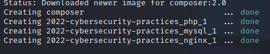
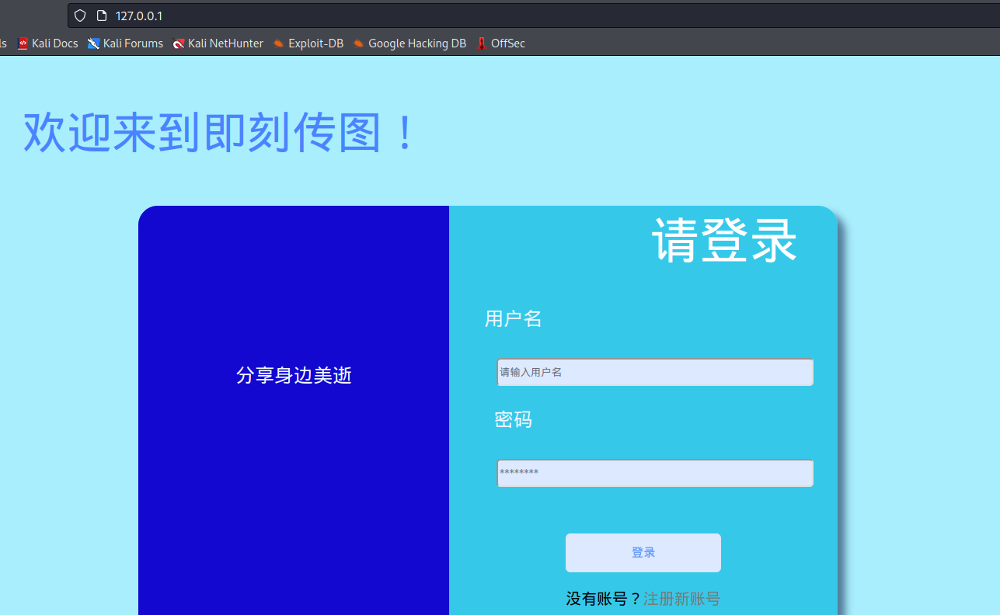

# BreakIt过程详解

## 实验环境

* VMware16pro
* linux kali22.1
* docker

## 工具使用

## 环境搭建

```bash
# 使用docker快速部署
$ git clone https://github.com/Vir-Dominary/2022-Cybersecurity-Practices.git
$ cd 2022-Cybersecurity-Practices

# 切换到相应分支（后续合并到主目录时还需更改）
$ git checkout docker-byzfd 

# 注意普通用户没有运行docker容器的权限，把普通用户加入到docker组中
$ sudo gpasswd -a $USER docker 
$ newgrp docker

$ docker-compose up -d
```



搭建完毕以后访问 ``127.0.0.1``应用环境，如下图所示：



## 信息收集

### 端口扫描

```bash
# Intense scan
$ nmap -T4 -A -v 127.0.0.1

Discovered open port 80/tcp on 127.0.0.1
Discovered open port 3306/tcp on 127.0.0.1
Discovered open port 443/tcp on 127.0.0.1
Discovered open port 9000/tcp on 127.0.0.1

PORT     STATE SERVICE     VERSION
80/tcp   open  http        nginx 1.19.2
|_http-title: \xE5\x8D\xB3\xE5\x88\xBB\xE4\xBC\xA0\xE5\x9B\xBE
| http-methods: 
|_  Supported Methods: GET HEAD
|_http-server-header: nginx/1.19.2

443/tcp  open  tcpwrapped

3306/tcp open  mysql       MySQL 5.7.39
| mysql-info: 
|   Protocol: 10
|   Version: 5.7.39
|   Thread ID: 23
|   Capabilities flags: 65535
|   Some Capabilities: Speaks41ProtocolOld, Support41Auth, IgnoreSpaceBeforeParenthesis, LongColumnFlag, InteractiveClient, SupportsLoadDataLocal, SwitchToSSLAfterHandshake, SupportsTransactions, Speaks41ProtocolNew, IgnoreSigpipes, ConnectWithDatabase, SupportsCompression, LongPassword, ODBCClient, DontAllowDatabaseTableColumn, FoundRows, SupportsMultipleStatments, SupportsMultipleResults, SupportsAuthPlugins
|   Status: Autocommit
|   Salt: s>\x0F\x0Ek&?OkmUU#9XrY{Ws
|_  Auth Plugin Name: mysql_native_password
|_ssl-date: TLS randomness does not represent time
| ssl-cert: Subject: commonName=MySQL_Server_5.7.39_Auto_Generated_Server_Certificate
| Issuer: commonName=MySQL_Server_5.7.39_Auto_Generated_CA_Certificate
| Public Key type: rsa
| Public Key bits: 2048
| Signature Algorithm: sha256WithRSAEncryption
| Not valid before: 2022-08-04T13:16:15
| Not valid after:  2032-08-01T13:16:15
| MD5:   a793 adda 1076 1749 7faf 0c69 6439 26eb
|_SHA-1: 72ae 19b0 fc2a 9e6d a7c2 e680 dbeb a4df d0cd bfe8
9000/tcp open  cslistener?

Device type: general purpose
Running: Linux 2.6.X
OS CPE: cpe:/o:linux:linux_kernel:2.6.32
OS details: Linux 2.6.32
Uptime guess: 38.279 days (since Mon Jun 27 18:35:01 2022)
Network Distance: 0 hops
TCP Sequence Prediction: Difficulty=259 (Good luck!)
IP ID Sequence Generation: All zeros

```

扫描得到4个开放端口的信息：80(http nginx 1.19.2),443(https),3306(mysql 5.7.39),9000(cslistener)，以及主机操作系统等信息。
