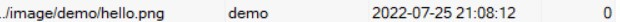

*注：本次渗透测试的目的是纠正网站内已有的漏洞，让攻击网站的手段有且只有唯一一种。由于只需要找到存在的漏洞，因此测试将止步于探测后，不获取用户与管理员密码。*<font size=4>**渗透测试的全流程请参考[网络安全在线课本第六章](https://c4pr1c3.github.io/cuc-ns/chap0x06/main.html)**</font>

# 更新日志（倒序）：

<u>2022.7.25：漏洞测试文档初公布。本次测试以确认存在的漏洞有：</u>

# 正文：测试全流程一览

## 一、信息收集

由于本次测试的对象网页由自己编写，因此，信息收集的部分的难度极低。

简单整理该网页的基本信息如下：

    脚本语言：php
    所用服务器类型（版本）：Nginx 1.15.11
    使用的数据库类型（版本）：MySQL 5.7.26

## 二、预处理

*注：为了防止检测过程的命令与代码对原网站产生不必要的影响，测试过程新建了数据库与数据表。由于沿用了网站的结构和代码，因此与直接检测原网站有着相同的效果。*

1、创建数据库/表

```sql
create datebase virdy
create table virdy

create table user(id int, name char(30), pawd char(40));
create table pwd(id int, name char(30), pawd char(40));

insert into `virdy` (`id`, `title`, `text`) values (1,'admin','hello admin');
insert into `virdy` (`id`, `title`, `text`) values (2,'virdy','hello virdy');
insert into `virdy` (`id`, `title`, `text`) values (3,'guest','hello guest');
```

结构如图所示：


2、创建一个可上传和返回值的测试界面

测试界面的源码如下：[index.php](index.php)

如果想要复现index.php的检测功能，请灵活移动

## 三、漏洞探测

对网站作简单的探测，测试其是否有常见的漏洞。常见漏洞按照[owasp top ten](https://owasp.org/www-project-top-ten/)中所给出的顺序排序。由于本网站制作简单，所实现的功能有限，许多漏洞并没有存在的前提条件，因此部分常见却不可能存在的漏洞将不会出现在本测试中。取而代之的是同类型网站中常见的漏洞。

1.强制访问控制<font size=6 color=red>(exist)</font>

>*Access control enforces policy such that users cannot act outside of their intended permissions.*   

将测试过程整理出具有代表性的[测试日志](testimony/Broken%20Access%20Control.txt)。

可以看到，对于部分php文件——如connect.php，是无法通过强制访问查看的。但同样为php文件的home.php，虽然会由于攻击者未登录而被弹回到index.html，但却暴露了网站的存储结构。而对于image下的图像，不需要任何权限、甚至不需要登录就能查看。

2.加密失败<font size=6 color=red>(exist)</font>

> Previously known as Sensitive Data Exposure, which is more of a broad symptom rather than a root cause, the focus is on failures related to cryptography (or lack thereof). Which often lead to exposure of sensitive data. Notable Common Weakness Enumerations (CWEs) included are CWE-259: Use of Hard-coded Password, CWE-327: Broken or Risky Crypto Algorithm, and CWE-331 Insufficient Entropy.

保存用户密码的方式直接且单薄，没有散列、混淆和加密等操作。本网站显然存在这个问题。

3.注入<font size=6 color=red>(exist)</font>

>Notable Common Weakness Enumerations (CWEs) included are CWE-79: Cross-site Scripting, CWE-89: SQL Injection, and CWE-73: External Control of File Name or Path.

应用程序不会验证、过滤或清理用户提供的数据，留下了巨大的sql注入空间。强烈建议对所有输入进行自动化测试。

在黑盒测试中，常见的注入方式未能成功.

检查代码时发现在[connect.php](testimony/Injection.txt)中，username&password两项均为没有任何安全措施的直接输入，因此本网站的白盒测试未通过。

4.设计（逻辑）漏洞<font size=6 color=red>(exist)</font>

> Insecure design is a broad category representing different weaknesses, expressed as “missing or ineffective control design.” Insecure design is not the source for all other Top 10 risk categories. There is a difference between insecure design and insecure implementation. We differentiate between design flaws and implementation defects for a reason, they have different root causes and remediation. A secure design can still have implementation defects leading to vulnerabilities that may be exploited. An insecure design cannot be fixed by a perfect implementation as by definition, needed security controls were never created to defend against specific attacks. One of the factors that contribute to insecure design is the lack of business risk profiling inherent in the software or system being developed, and thus the failure to determine what level of security design is required.

不安全设计不同于其他九种漏洞，它并不是代码层面的漏洞，而是设计逻辑上的漏洞。即使是完美的代码实现，也无法掩盖逻辑上的缺失。

在本网站中，密保问题数量少，且“喜爱的演员”是一个极易重合的群体，因此有被攻击者利用的风险。

5.配置项的安全问题<font size=6 color=red>(exist)</font>

>The application might be vulnerable if the application is:
> + Missing appropriate security hardening across any part of the application stack or improperly configured permissions on cloud services.
>+ Unnecessary features are enabled or installed (e.g., unnecessary ports, services, pages, accounts, or privileges).
> + Default accounts and their passwords are still enabled and unchanged.
> + Error handling reveals stack traces or other overly informative error messages to users.
> + For upgraded systems, the latest security features are disabled or not configured securely.
> + The security settings in the application servers, application frameworks (e.g., Struts, Spring, ASP.NET), libraries, databases, etc., are not set to secure values.
> + The server does not send security headers or directives, or they are not set to secure values.
> + The software is out of date or vulnerable (see A06:2021-Vulnerable and Outdated Components).  
>
>Without a concerted, repeatable application security configuration process, systems are at a higher risk.

默认账户（admin）未修改；

服务器未禁用目录列表；

服务器允许返回详细的报错信息。


6.老旧设备、软件<font size=6 color=green>(not exist)</font>

>You are likely vulnerable:
> + If you do not know the versions of all components you use (both client-side and server-side). This includes components you directly use as well as nested dependencies.
> + If the software is vulnerable, unsupported, or out of date. This includes the OS, web/application server, database management system (DBMS), applications, APIs and all components, runtime environments, and libraries.
> + If you do not scan for vulnerabilities regularly and subscribe to security bulletins related to the components you use.
> + If you do not fix or upgrade the underlying platform, frameworks, and dependencies in a risk-based, timely fashion. This commonly happens in environments when patching is a monthly or quarterly task under change control, leaving organizations open to days or months of unnecessary exposure to fixed vulnerabilities.
> + If software developers do not test the compatibility of updated, upgraded, or patched libraries.
> + If you do not secure the components’ configurations (see A05:2021-Security Misconfiguration).

本网站中用到的工具或插件数量少，各项产品都处于使用周期内，暂时不存在过时的客户端和服务器。

7.身份验证失效<font size=6 color=red>(exist)</font>

>Confirmation of the user's identity, authentication, and session management is critical to protect against authentication-related attacks. There may be authentication weaknesses if the application:
> + Permits automated attacks such as credential stuffing, where the attacker has a list of valid usernames and passwords.
> + Permits brute force or other automated attacks.
> + Permits default, weak, or well-known passwords, such as "Password1" or "admin/admin".
> + Uses weak or ineffective credential recovery and forgot-password processes, such as "knowledge-based answers," which cannot be made safe.
> + Uses plain text, encrypted, or weakly hashed passwords data stores (see A02:2021-Cryptographic Failures).
> + Has missing or ineffective multi-factor authentication.
> + Exposes session identifier in the URL.
> + Reuse session identifier after successful login.
> + Does not correctly invalidate Session IDs. User sessions or authentication tokens (mainly single sign-on (SSO) tokens) aren't properly invalidated during logout or a period of inactivity.

缺少多因素身份认证；

登录错误后可再次尝试，且没有次数限制，存在被爆破的可能；

在 URL 中公开会话标识符;

......

8.数据缺失、文件受损<font size=4 color=yellow>(maybe exist)</font>

>Software and data integrity failures relate to code and infrastructure that does not protect against integrity violations. An example of this is where an application relies upon plugins, libraries, or modules from untrusted sources, repositories, and content delivery networks (CDNs). An insecure CI/CD pipeline can introduce the potential for unauthorized access, malicious code, or system compromise. Lastly, many applications now include auto-update functionality, where updates are downloaded without sufficient integrity verification and applied to the previously trusted application. Attackers could potentially upload their own updates to be distributed and run on all installations. Another example is where objects or data are encoded or serialized into a structure that an attacker can see and modify is vulnerable to insecure deserialization.

不存在文件或数据的缺失，暂无完整性风险。

但没有文件完整性的保障机制

9.无保障机制<font size=6 color=red>(exist)</font>

>Returning to the OWASP Top 10 2021, this category is to help detect, escalate, and respond to active breaches. Without logging and monitoring, breaches cannot be detected. Insufficient logging, detection, monitoring, and active response occurs any time:
> + Auditable events, such as logins, failed logins, and high-value transactions, are not logged.
> + Warnings and errors generate no, inadequate, or unclear log messages.
> + Logs of applications and APIs are not monitored for suspicious activity.
> + Logs are only stored locally.
> + Appropriate alerting thresholds and response escalation processes are not in place or effective.
> + Penetration testing and scans by dynamic application security testing (DAST) tools (such as OWASP ZAP) do not trigger alerts.
> + The application cannot detect, escalate, or alert for active attacks in real-time or near real-time.

没有检测与监控措施，也没有远程日志或者警报。在被攻击时实时防御

10.Server-Side Request Forgery (SSRF)<font size=6 color=red>(exist)</font>

>SSRF flaws occur whenever a web application is fetching a remote resource without validating the user-supplied URL. It allows an attacker to coerce the application to send a crafted request to an unexpected destination, even when protected by a firewall, VPN, or another type of network access control list (ACL).  
>As modern web applications provide end-users with convenient features, fetching a URL becomes a common scenario. As a result, the incidence of SSRF is increasing. Also, the severity of SSRF is becoming higher due to cloud services and the complexity of architectures.

网络架构未分段，攻击者可以映射内部网络;

敏感数据暴露——攻击者可以访问本地文件或内部服务来获取敏感信息。

11.文件上传漏洞<font size=6 color=red>(exist)</font>

原文件为php文件，仅修改后缀即可上传并存储在后端


网站只在前端检测了后缀名，没有加以后台验证。存在上传——抓包——修改——执行的绕过方法。

## 四、漏洞利用

由于本次测试仅需找到漏洞，因此不利用漏洞进行攻击。

# 后记

开发尚在进行，漏洞被修补后，若测试组确认无误，将会在此实时记录并更新，并附上更新日志。
