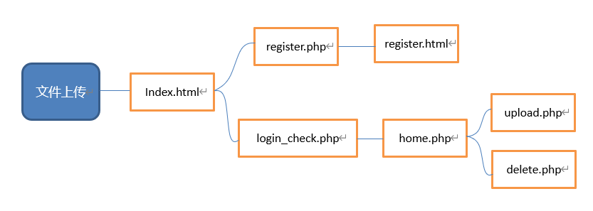
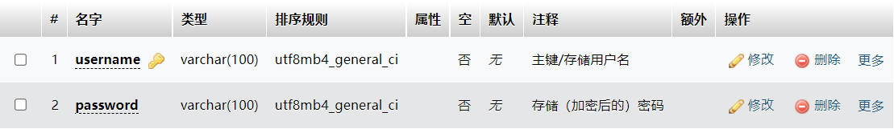
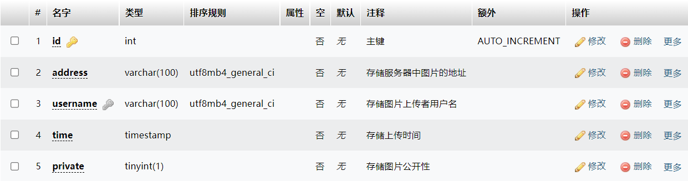

# 余先晶-个人总结技术报告

## 实验内容

使用php及html搭建一个仿真图片社交平台

## 个人工作内容

和小组成员曲乐然共同完成项目的 `Built It` 的工作，由我搭建总体的网站框架、参与仿真网站css及部分网站的安全加固

## 框架清单

- 基于数据库的用户注册登录系统
- 基于数据库的个人主页管理系统
- 基于网页的图片社交功能

## 框架图

- 大纲：



- user表：



- image表：



- 约束：


- 初版css效果及基础功能演示：

[演示视频](File:///img/web 2.0.mp4)


## 设计思路

- 主要通过 `php` 和 `html` 及 `css` 语言进行初始开发。
- 我主要借鉴了微信和微博的图片上传与展示功能，并还原了主要的图片上传、浏览、管理功能。
- 得益于 `php` 语言的快捷性和对数据库兼容的广泛性，前期的开发所遇到的问题并不多。但伴随而来的是框架背后的众多漏洞，如 `XSS` 漏洞和 `SQL` 注入等常见漏洞。

## 漏洞处理

在设计框架时，对几个常见漏洞做了简单处理：

- 由于是图片社交平台，具备了文件白名单，在 `upload.php` 中过滤非法格式的文件。

```php
 if((($_FILES["file"]["type"]=="image/gif") 
        || ($_FILES["file"]["type"] == "image/jpeg")
        || ($_FILES["file"]["type"] == "image/jpg")
        || ($_FILES["file"]["type"] == "image/pjpeg")
        || ($_FILES["file"]["type"] == "image/x-png")
        || ($_FILES["file"]["type"] == "image/png")) 
        && in_array($extension, $allowed_ext)){
        if($_FILES["file"]["error"]>0){
            echo "上传错误：".$_FILES["file"]["error"]."<br>";
        }
        else{
            if(file_exists("../image/$username/".$_FILES["file"]["name"])){
                $str=$_FILES["file"]["name"]."已存在，请更改文件名";
                alert($str,"home.php");
            }
            else{
                if($private==NULL){
                    alert("未选择图片公开选项","home.php");
                }
                else{
                    $addr="../image/$username/".$_FILES["file"]["name"];
                    move_uploaded_file($_FILES["file"]["tmp_name"], $addr);
                    alert('上传成功','home.php');
                    $sql="INSERT into image(address,username,time,private) values('$addr','$username',NOW(),'$private')";
                    if(mysqli_query($con,$sql)){
                        alert('上传成功','home.php');
                    }
                }
            }
        }
    }
    else{
        alert("文件格式非法","home.php");
    }
```

- 在测试功能的过程中，使用爬虫绕过验证也可对上传后的私密图片进行篡改操作，为此添加删除验证。

```php
 $addr=$_POST['address'];
    
    $sql="DELETE from image where address='$addr'";
    mysqli_query($con, $sql);
    
    if(mysqli_query($con, $sql) && unlink($addr)){ //删除服务器和数据库中图片的痕迹
        alert("删除成功", "home.php");
    }
    else{
        alert("删除失败", "home.php");
    }
```

更多的漏洞修补细节见曲乐然的个人技术总结~

## 学习收获

在本次的实验当中，我对web网站应用的搭建有了更深刻的认识和理解。此前我对 `php` 和 `css` 语法一知半解，为此通过各方资源学习基础语法，并在实践中完善自己的代码。 `php` 作为 `web` 交互语言能很方便地实现 `web` 应用的功能。当然，我们也不能仅仅依赖于 `php` 语言，有些情况下  `javascript`  会更好用，功能也更佳。通过这次实践，我也对整个前后端的开发流程有了更直接的认识。

## 参考资料

[php、html、css基础学习](https://www.bilibili.com/video/BV19R4y1c7Zv?spm_id_from=333.337.search-card.all.click)

[php菜鸟教程](https://www.runoob.com/php/php-tutorial.html)

[AMPPS工具教程](https://blog.csdn.net/weixin_44305576/article/details/86982211)

